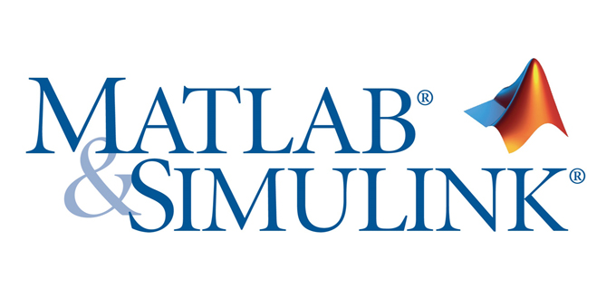

# Automatic Control

## Description
A collection of laboratory experiments and simulation models developed for the **Controlli Automatici** (Automatic Control) course during my Bachelor's Degree in Computer Engineering at **Politecnico di Torino**. The repository covers dynamic system modeling, stability analysis in the frequency and time domains, and the synthesis of feedback controllers (PID, lead/lag compensators) using MATLAB and Simulink.

---

## Core Competencies & Topics Covered

* **Dynamic System Modeling:** Formulating continuous-time state-space representations and transfer functions for linear time-invariant (LTI) physical systems.
* **Time-Domain Response:** Evaluating transient and steady-state responses to standard inputs (step, ramp, impulse), analyzing rise time, overshoot, settling time, and steady-state errors.
* **Frequency-Domain Analysis:** Constructing and interpreting Bode plots, Nyquist diagrams, and Nichols charts to evaluate open-loop and closed-loop behaviors.
* **Stability Margins & Criteria:** Assessing asymptotic stability using the Routh-Hurwitz criterion, Nyquist stability criterion, gain margin ($K_m$), and phase margin ($\Phi_m$).
* **Root Locus Synthesis:** Analyzing closed-loop pole trajectories as a function of loop gain and placing closed-loop poles to meet transient specifications.
* **Controller Design & Tuning:** Designing classical PID controllers (proportional, integral, derivative) and loop-shaping compensators (lead, lag, lead-lag networks) to achieve target bandwidth and phase margins.

---

## Technologies & Tools

* **Languages & Simulation Tools:** MATLAB, Simulink
* **Toolboxes:** Control System Toolbox